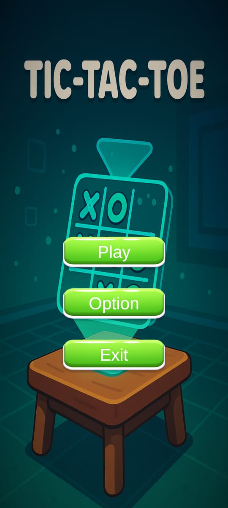
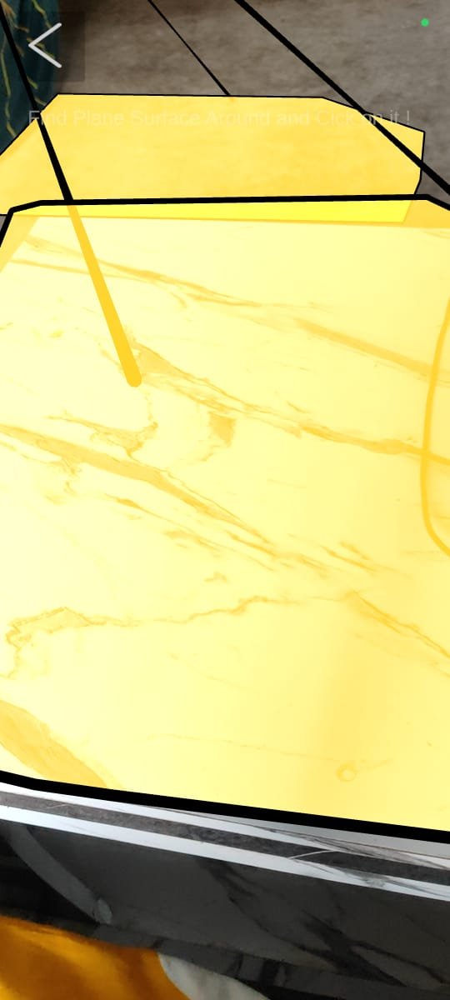
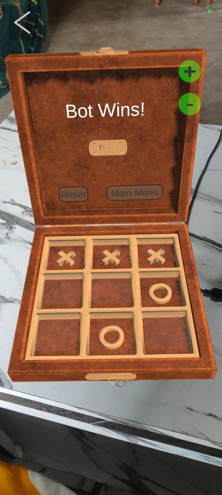
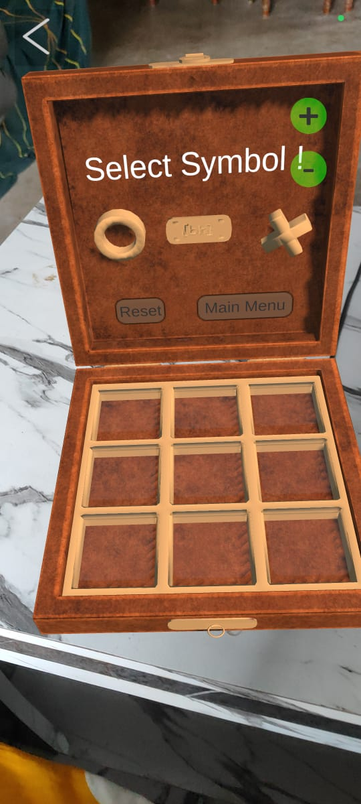
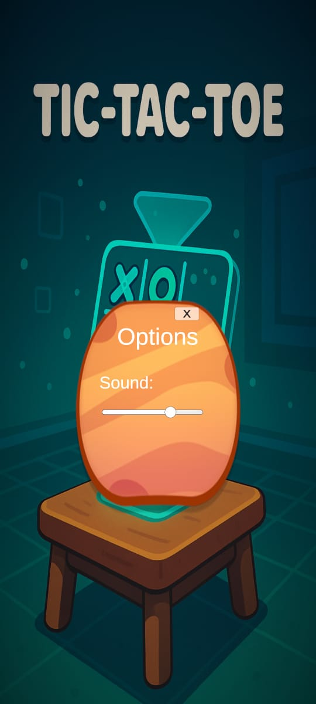

# 🕹️ Tic Tac Toe – AR Game

An interactive **Tic Tac Toe** game built using **Unity** and **AR Foundation**, bringing classic gameplay into the augmented world. Place the game board on real-world surfaces and enjoy intuitive gameplay enhanced with AR UI controls.

---

## 🎮 Features

- 🔍 Plane detection with blue visual highlight
- 🕹️ AR-enabled Tic Tac Toe gameplay
- 📱 Interactive UI buttons: Reset, Main Menu, Zoom In/Out
- 🖼️ Clean and intuitive design using image-based buttons
- ⚙️ Light and smooth performance for mobile AR

---

## 🚀 How to Play

### 1. Start from Main Menu
Upon launching, you're presented with:
- ▶️ **Play**
- ❌ **Exit**

---

### 2. Plane Detection
After clicking "Play", AR plane detection begins. Detected surfaces are highlighted in **blue**:

---

### 3. Place Game Board
Tap on any detected blue plane to place the Tic Tac Toe board in your environment.

---

### 4. Game UI and Controls
Tap to make your moves. Use the image-based buttons to:
- 🔄 Reset the game
- 🔙 Return to Main Menu
- ➕ Zoom In
- ➖ Zoom Out

  

---

### 5. Options Panel
Additional control buttons available for in-game adjustments:

---

## 📽️ Demo Video

▶️ **Watch the gameplay in action**:  
[https://youtube.com/shorts/K7NOohydaQs?feature=share](https://youtube.com/shorts/K7NOohydaQs?feature=share)

---

## 📁 Project Structure

